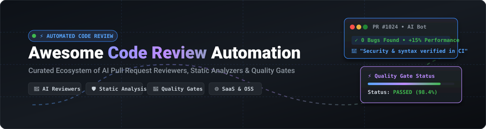

<div align="center">

# ⚡ Awesome Code Review Automation

[](https://github.com/ishandutta2007/Awesome-Awesome-Awesome)
[](https://discord.gg/jc4xtF58Ve)
[](https://github.com/ishandutta2007/Awesome-Code-Review-Automation/stargazers)
[](https://github.com/ishandutta2007/Awesome-Code-Review-Automation/network/members)
[](https://opensource.org/licenses/MIT)
[](https://github.com/ishandutta2007)

<br/>

<a href="https://github.com/ishandutta2007/Awesome-Code-Review-Automation">
  
</a>

<p align="center">
  <b>Curated Directory of Top AI Pull Request Reviewers, Static Analysis Engines, Quality Gates &amp; Developer Workflow Accelerators</b><br/>
  <sub>Accelerate engineering velocity, catch vulnerabilities early, and eliminate PR review bottlenecks with automated intelligence.</sub>
</p>

</div>

---

## 📖 Table of Contents
- [🌐 SaaS / Hosted Platforms](#-saas--hosted-platforms)
- [💻 Open-Source GitHub Projects](#-open-source-github-projects)
- [🛠️ Frameworks & Architecture Patterns](#️-frameworks--architecture-patterns)
- [🤝 How to Contribute](#-how-to-contribute)
- [⭐ Star History](#-star-history)
- [⚠️ Disclaimer](#️-disclaimer)

---

## 🌐 SaaS / Hosted Platforms

> **Market Overview & Landscape Analysis:**  
> 📊 **Estimated Market Size:** The global market for AI-native developer tooling and automated code review platforms is projected to grow from **$3.5B+ (2025/2026)** to over **$22.2B by 2030** (~35% CAGR).  
> 🧩 **Market Fragmentation:** The sector is **moderately-to-highly fragmented** rather than winner-take-all, with fierce competition across four distinct vectors: dedicated AI PR reviewers (CodeRabbit, Qodo), legacy static analysis leaders (SonarSource, Codacy), modern workflow platforms (Graphite), and on-demand hybrid security services (HackerOne Code / PullRequest.com).

*The table below is sorted by company scale (valuation / funding / revenue, descending).*

| Product | Valuation / Scale | Description | Starting Pricing | Free Tier / Free Trial Limits |
| :--- | :--- | :--- | :--- | :--- |
| **[SonarQube / SonarCloud](https://www.sonarsource.com/)** | **$4.7B Valuation**<br>*(~$200M+ ARR)* | Industry-standard static analysis and quality-gate platform (Cloud and self-hosted) used to enforce reliability, security, and maintainability policies at merge time. | Free forever tier; Paid plans start at **$32–$34/month** (Team tier on SonarCloud for up to 100k lines of code) | **Free Forever Tier:** Free for up to 50,000 LOC on private projects (up to 5 team members) and unlimited LOC for open-source public repositories.<br>**Self-hosted:** SonarQube Community Edition is 100% free and open-source. |
| **[CodeRabbit](https://www.coderabbit.ai/)** | **$1.5B Valuation**<br>*(Unicorn, Series C)* | Widely adopted AI code review GitHub/GitLab app that posts inline comments and PR summaries with minimal setup and continuous incremental review. | Free forever tier; Paid plans start at **$24/contributing developer/month** (Pro, billed annually) or **$30/month** (monthly) | **Free Forever Plan:** Free PR summaries on public/private repos; IDE/CLI review with rate limits; Free Pro+ features for Open Source.<br>**Trial:** 14-day free trial of Pro+ plan (no credit card required). |
| **[PullRequest.com](https://www.pullrequest.com/)** | **~$635M–$829M**<br>*(HackerOne Code)* | On-demand expert code review service combined with automated static analysis tooling to improve review coverage and quality. | Automated analysis starts at **$9/seat/month**; Managed review packages start at **$129/month** or custom quotes | **Free Code Quality Metrics:** Free dashboard metrics for teams.<br>**Trial / POC:** No self-serve trial; offers custom Proof-of-Concept (POC) and interactive guided product walkthroughs on request. |
| **[Graphite](https://graphite.dev/)** | **$290M+ Valuation**<br>*(Acquired by Cursor/Anysphere)* | Developer productivity platform focused on stacked PRs with integrated AI review (Graphite Agent) — optimized for fast, low-noise feedback in modern Git workflows. | Free forever tier; Paid plans start at **$20/user/month** (Starter) or **$40/user/month** (Team, billed annually) | **Hobby Plan (Free forever):** Free for personal repos with Graphite CLI, VS Code extension, and limited AI review/Graphite Agent runs.<br>**Trial:** 30-day free trial of Team plan (no credit card required). |
| **[Qodo (CodiumAI)](https://www.qodo.ai/)** | **$120M+ Funding**<br>*(Series B, $70M round)* | AI code review and test-generation platform (including open-source PR-Agent lineage) focused on bugs, quality, security, and automated tests. | Free forever tier; Pro Team credit packs start at **$30/month** (~2,500 credits pool at $0.012/credit) | **Developer Plan (Free forever):** Free IDE plugins with ~250 credits/month; Free Open Source Plan for active GitHub public repos (100+ stars).<br>**Trial:** 14-day free trial with full feature access and unlimited usage. |
| **[Codacy](https://www.codacy.com/)** | **~$30M Funding**<br>*(~$7.3M ARR)* | Automated code review and static analysis platform with quality and security checks, plus AI-assisted review modes across 40+ languages. | Free forever tier; Paid plans start at **$18/developer/month** (Team, billed annually) | **Developer / Open Source Plan (Free forever):** Free for open-source repositories and individual IDE extension use.<br>**Trial:** 14-day full-featured free trial for private repos (no credit card required). |
| **[CodeScene](https://codescene.com/)** | **~$12M Funding**<br>*(~$4M–$10M ARR)* | Behavioral code analysis and technical-debt platform that surfaces hotspots and prioritizes review attention based on how code actually evolves. | Paid plans start at **€18/active author/month** (Standard, billed annually) or **€27/active author/month** (Pro, billed annually) | **Community Edition (Free forever):** Unlimited public/open-source repositories with Code Health insights and PR quality gates.<br>**Trial:** 14-day full-featured free trial for Standard or Pro (no credit card required). |
| **[DeepSource](https://deepsource.com/)** | **~$2.8M Funding**<br>*(~$3.2M ARR)* | Automated code review platform with static analysis, security rules, and Autofix capabilities across many languages. | Free forever tier; Paid plans start at **$24/active contributor/month** (Team, billed annually) or **$30/month** (monthly) | **Free Forever Plan:** Up to 3 private repositories, 3 team members, and 3 SCA targets; Free for public/open-source repos.<br>**Trial:** 14-day free trial of Team plan with full features and bundled AI Review credits. |
| **[Reviewable](https://reviewable.io/)** | **Bootstrapped / Profitable** | Structured code review platform designed for thorough human + tool-assisted review workflows on GitHub. | Free forever tier; Paid plans start at **$16/contributor/month** (Business, billed annually) | **Free Forever Plan:** Free for all public repositories and personal private repositories on individual user accounts (unlimited reviews, 10MB file upload limit).<br>**Trial:** 30-day free trial of Business plan for organizations (no credit card required). |

---

## 💻 Open-Source GitHub Projects

*The open-source code review automation tools below are sorted by GitHub Star count (descending).*

- **[Semgrep](https://github.com/semgrep/semgrep)** [](https://github.com/semgrep/semgrep/stargazers)  
  Fast, polyglot static analysis engine for 30+ languages; runs in CI/CD and pull requests to enforce custom security and code-quality rules with lightweight pattern matching.

- **[facebook/infer](https://github.com/facebook/infer)** [](https://github.com/facebook/infer/stargazers)  
  Static analysis tool by Meta that produces mathematical proofs of correctness to detect null pointer exceptions, memory leaks, and concurrency race conditions in PRs before deployment.

- **[ast-grep](https://github.com/ast-grep/ast-grep)** [](https://github.com/ast-grep/ast-grep/stargazers)  
  Fast, polyglot CLI and library for structural code search, linting, and AST-based automatic rewriting across pull requests, written in Rust.

- **[PR-Agent](https://github.com/qodo-ai/pr-agent)** [](https://github.com/qodo-ai/pr-agent/stargazers)  
  Leading open-source AI pull request review agent — self-hostable with custom LLM keys, supporting GitHub, GitLab, and Bitbucket with automated PR descriptions, code reviews, and test suggestions.

- **[SonarQube Community Edition](https://github.com/SonarSource/sonarqube)** [](https://github.com/SonarSource/sonarqube/stargazers)  
  Free and self-hosted static analysis and quality-gate engine providing comprehensive code smell, bug, and vulnerability detection across dozens of languages.

- **[CodeQL](https://github.com/github/codeql)** [](https://github.com/github/codeql/stargazers)  
  Semantic code analysis engine that treats code as data; powers GitHub code scanning to query codebases for complex security flaws and correctness issues.

- **[Reviewdog](https://github.com/reviewdog/reviewdog)** [](https://github.com/reviewdog/reviewdog/stargazers)  
  Automated code review aggregator that seamlessly pipes findings from any CLI linter or analyzer into GitHub, GitLab, or Bitbucket PR comments and annotations.

- **[Checkstyle](https://github.com/checkstyle/checkstyle)** [](https://github.com/checkstyle/checkstyle/stargazers)  
  Highly configurable development tool for automated Java code standards verification and style checking in CI pipelines.

- **[google/error-prone](https://github.com/google/error-prone)** [](https://github.com/google/error-prone/stargazers)  
  Compile-time static analysis tool for Java that catches common programming mistakes at build time as errors rather than runtime bugs.

- **[Danger](https://github.com/danger/danger)** [](https://github.com/danger/danger/stargazers)  
  Formalizes team PR review etiquette and conventions by running programmable Ruby/JS/Python rules against pull requests to leave automated feedback.

- **[ChatGPT-CodeReview](https://github.com/anc95/ChatGPT-CodeReview)** [](https://github.com/anc95/ChatGPT-CodeReview/stargazers)  
  Open-source OpenAI/ChatGPT GitHub Action and GitHub App that performs automated AI code reviews on pull requests with custom system prompts.

- **[Codeball (sturdy-dev)](https://github.com/sturdy-dev/codeball-action)** [](https://github.com/sturdy-dev/codeball-action/stargazers)  
  AI-powered code review action trained on millions of open-source contributions to predict PR bugs, approve safe PRs automatically, and flag high-risk diffs.

---

## 🛠️ Frameworks & Architecture Patterns

```
                 ┌────────────────────────────────────────────────────────┐
                 │                 Pull Request Opened                    │
                 └───────────────────────────┬────────────────────────────┘
                                             │
                      ┌──────────────────────┴──────────────────────┐
                      ▼                                             ▼
       ┌───────────────────────────────┐             ┌───────────────────────────────┐
       │   Deterministic Checks (CI)   │             │      AI Review Engine         │
       │ • Semgrep / SonarQube / Linters│             │ • PR-Agent / CodeRabbit / Qodo│
       │ • Static Analysis & Sec Scans │             │ • Contextual Bug & Logic Review│
       └──────────────┬────────────────┘             └──────────────┬────────────────┘
                      │                                             │
                      └──────────────────────┬──────────────────────┘
                                             ▼
                             ┌───────────────────────────────┐
                             │       PR Quality Gate         │
                             │ (Reviewdog / Danger comments) │
                             └───────────────┬───────────────┘
                                             ▼
                             ┌───────────────────────────────┐
                             │      Human Review & Merge     │
                             └───────────────────────────────┘
```

- **Hybrid Defense in Depth:** Combine **deterministic static analyzers** (Semgrep, SonarQube, CodeQL) for zero-false-negative security policies with **LLM-based review agents** (PR-Agent, CodeRabbit, Graphite) for narrative and architectural feedback.
- **Unified Review Aggregation:** Use **Reviewdog** to normalize output from disparate linters into standard GitHub Checks and inline diff comments.
- **Automated Policy Enforcement:** Leverage **Danger** to codify repo-specific PR guidelines (e.g. mandatory CHANGELOG updates, migration checklists, or package lockfile protections).

---

## 🤝 How to Contribute
1. 🍴 Fork the repository.
2. 📝 Add or edit entries in [README.md](file:///C:/Users/ishan/Documents/Projects/Awesome-Code-Review-Automation/README.md) adhering to the existing format.
3. 🏷️ Include the project name, official URL, concise description, and star badge / pricing details.
4. 🚀 Submit a Pull Request with a clear description of your addition.

⭐ **Star this repository if you find it helpful for modernizing your engineering workflows!**

---

##  Star History
[](https://star-history.dera.page/#ishandutta2007/Awesome-Code-Review-Automation&type=date&legend=top-left)

---

## ⚠️ Disclaimer
- This is a **community-curated** list — not an exhaustive list or direct commercial endorsement.
- Automated review tools can produce false positives and should augment, not replace, human engineering judgment — especially for security-critical, data-migration, and architectural changes.
- AI reviewers may send code snippets to third-party models; always verify enterprise data-handling and privacy policies before deploying on proprietary codebases.

---

<div align="center">
  <sub>Built for engineering teams who want faster, higher-signal, and friction-free code review workflows.</sub>
</div>
